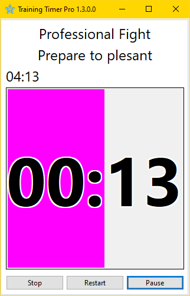
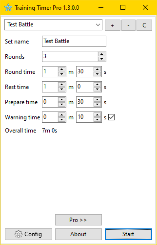

# Training Timer

  

This app is designed for tracking training time in various sports, from martial arts (boxing, MMA, etc.) to swimming and much more.

The app is designed for the Windows platform, becouse all similar apps are designed for mobile devices and nothing simple and usable for Windows.

A port to Android may be planned for the future.

## Binaries

Binaries available on [GitHub](https://github.com/SerufuYua/training_timer/releases)

## Building

Use [Lazarus](https://www.lazarus-ide.org/) to compile. 
Open in Lazarus `TrainingTimer.lpi` file and compile / run from Lazarus. 
Make sure to first register [PlaySoundPackage Lazarus packages](https://packages.lazarus-ide.org).

## Versions

### Version 1.2

Changes:

  * You can use sounds of your choice

  * Improved counting visualization

  * Improved timekeeping accuracy

### Version 1.1

First release
