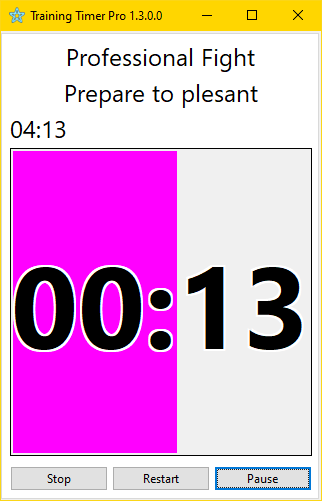
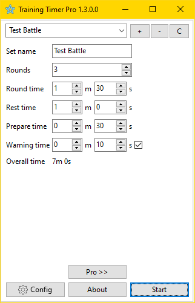
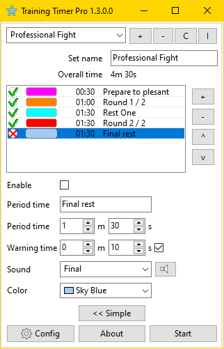
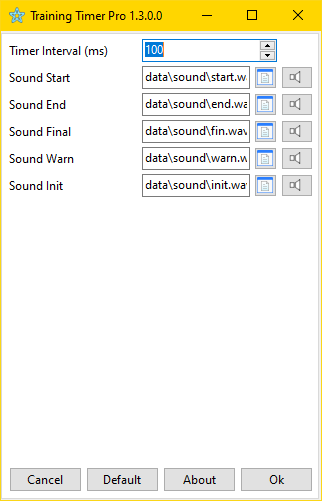

# Training Timer Professional

 
 

This app is designed for tracking training time in various sports, from martial arts (boxing, MMA, etc.) to swimming and much more.

Professional mode allows you to set any custom time periods with any sounds and signal colors. You can create your own chains of periods: progressive, regressive, with an extended rest period in the middle, and much more.

The app is designed for the Windows platform, becouse all similar apps are designed for mobile devices and nothing simple and usable for Windows.

The application is completely free and open source.

A port to Android may be planned for the future.

## Binaries

Binaries available on [itch.io](https://serufuyua.itch.io/training-timer-professional) and [GitHub](https://github.com/SerufuYua/training_timer/releases)

## Building

Use [Lazarus](https://www.lazarus-ide.org/) to compile. 
Open in Lazarus `TrainingTimer.lpi` file and compile / run from Lazarus. 
Make sure to first register [PlaySoundPackage Lazarus packages](https://packages.lazarus-ide.org).

## History

### Version 1.3.2

New Feature: Enable/Disable period by clicking to left side of Period List.

Bug fixes and refactoring.

### Version 1.3

Profesional settings.

### Version 1.2.1

Bug fixes and optimization.

### Version 1.2

Changes:

  * You can use sounds of your choice;

  * Improved counting visualization;

  * Improved timekeeping accuracy.

### Version 1.1

First release.
